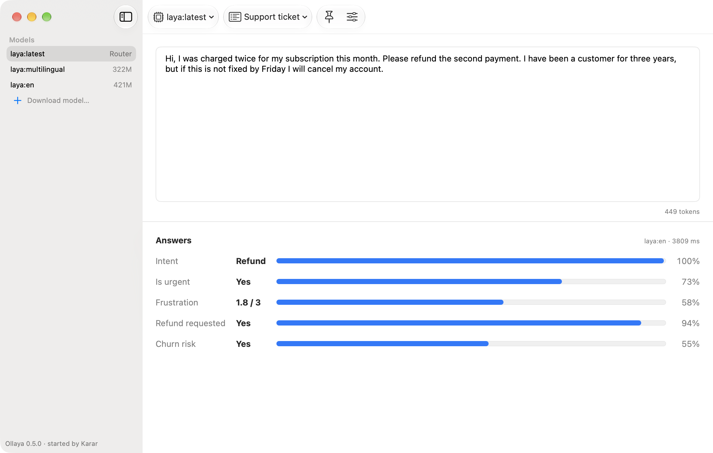
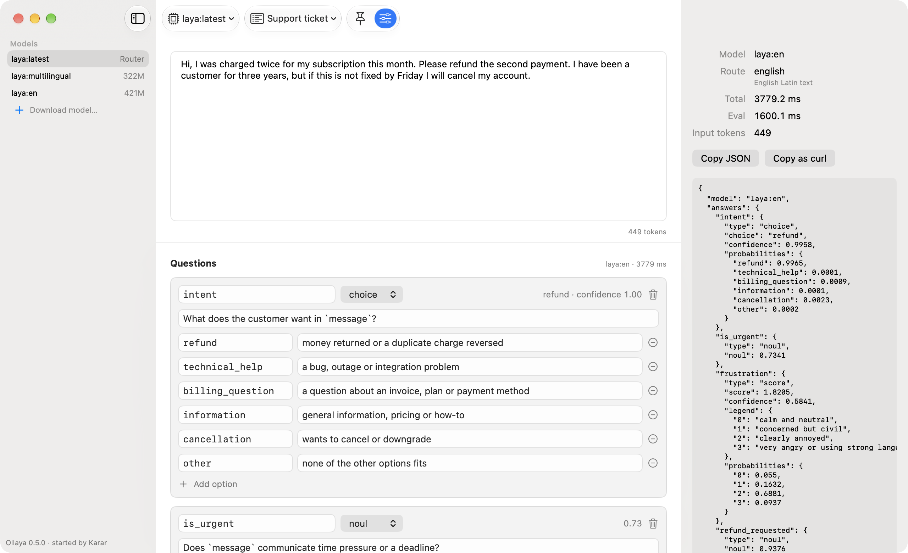
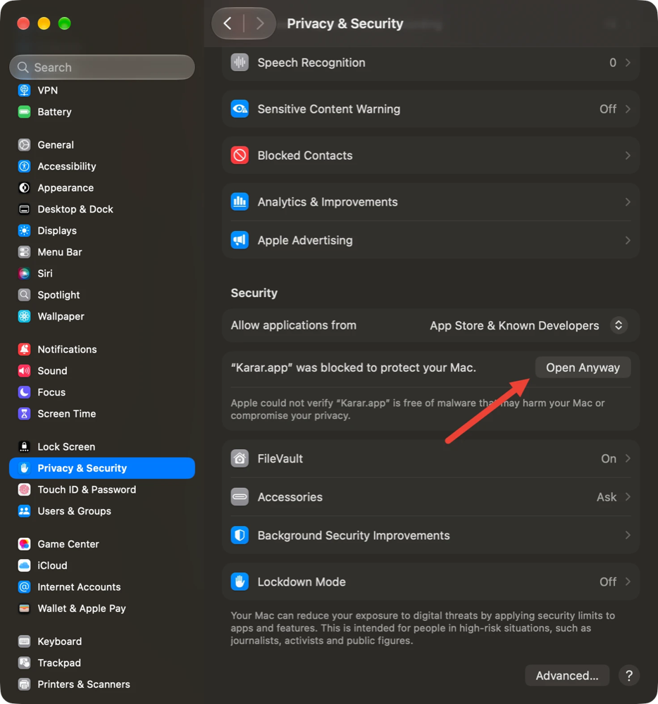

# Karar

**Karar - a Mac app for Ollaya.** Ask typed questions about any text and see calibrated answers
while you type. Everything runs on your Mac.

<picture>
  <source media="(prefers-color-scheme: dark)" srcset="docs/screenshots/main-dark.png">
  
</picture>

Karar is a native macOS app for [Ollaya](https://ollaya.dev), an engine for decision models.
Decision models don't write text: they read a text and answer typed questions about it: a choice
(refund, technical help, …), a score (2.4 of 3) or a yes/no, each with a calibrated confidence.
Karar bundles the engine, downloads models for you, and re-runs the questions every time you
pause typing.

**[Download Karar.dmg](https://github.com/omerhakanbilici/karar/releases/latest/download/Karar.dmg)**
· Apple silicon · macOS 14 or later · [All releases](https://github.com/omerhakanbilici/karar/releases)

## What Karar adds

Ollaya has its own desktop app, which runs the engine from the menu bar, downloads models and runs
a question set on a text. Karar is for working on the text and the questions:

- **A native SwiftUI app** that follows your Mac's light or dark appearance.
- **Live answers while you type**: each edit re-runs the questions a moment after you pause.
- **Editable question cards** (Advanced): change instructions and options, add choice, score and
  yes/no questions; an invalid question is marked on its own card.
- **An inspector**: which model answered and why, timings, token usage, the raw response, Copy JSON
  and Copy as curl.
- **A token counter** under the text, with the engine's own count, and a **truncation warning**
  when the text is longer than the model can read.
- **Pins**: ⌘↩ keeps a text and its answers in the sidebar, to compare them later.

<picture>
  <source media="(prefers-color-scheme: dark)" srcset="docs/screenshots/advanced-dark.png">
  
</picture>

Karar uses the same model store (`~/.ollaya`) as the `ollaya` command line and Ollaya's desktop
app. If one of them is already running, Karar uses that engine and leaves it running when you quit.

## Install

1. Download [Karar.dmg](https://github.com/omerhakanbilici/karar/releases/latest/download/Karar.dmg),
   open it and drag Karar to Applications.
2. Open Karar. Karar is not notarized by Apple, so macOS says it can't check the app for malware.
   Click **Done**. (On macOS 14 the button is **OK**; you can also Control-click Karar and choose
   **Open**.)
3. Open **System Settings → Privacy & Security**, scroll down to the message about Karar and click
   **Open Anyway**, then confirm. You only do this once.

   

On first launch Karar asks which model to download. `laya` is recommended: fast, 100+ languages,
about 1.5 GB.

## Build from source

You need Xcode 26 or later on Apple silicon. [XcodeGen](https://github.com/yonaskolb/XcodeGen) is
only needed if you change `project.yml`.

```sh
git clone https://github.com/omerhakanbilici/karar.git
cd karar
scripts/fetch-ollaya.sh        # the pinned Ollaya, checksum-verified, into vendor/
xcodebuild -project Karar.xcodeproj -scheme Karar -destination 'platform=macOS' -derivedDataPath build test
xcodebuild -project Karar.xcodeproj -scheme Karar -configuration Release -derivedDataPath build build
open build/Build/Products/Release/Karar.app
```

`scripts/make-dmg.sh` packs the build into `Karar.dmg`, and `scripts/smoke.sh` checks the bundled
engine against a real model. The `KararUITests` scheme has a few UI smoke tests that run locally
(see the header of `KararUITests/KararUITests.swift`).

## Licence

Karar is licensed under the [Apache License 2.0](LICENSE). It bundles Ollaya (Apache-2.0); see
[NOTICE](NOTICE) and [THIRD_PARTY.md](THIRD_PARTY.md) for Ollaya, the bundled question sets and
the models' licences. Models are downloaded from their authors and never redistributed by Karar.

Karar is not affiliated with or endorsed by the Ollaya project. "Ollaya" is only used to say what
Karar works with.
